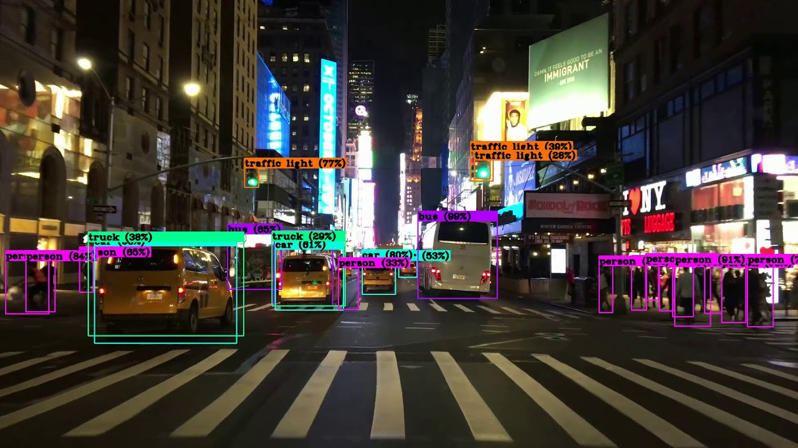

# Yolov3-Darknet

## Intro

Install and run YOLOv3 on Nvidia Jetson Series. YOLOv3 is a really popular DNN (Deep Neural Network) object detection algorythm, which is really fast and works also on not so powerfull devices. \
 \
Check out the complete tutorial [here](https://www.hikariai.net).

## Demo





## Setup

### Clone the Repository
```
cd ${HOME}
git clone https://github.com/yqlbu/Yolov3-Darknet
cd Yolov3-Darknet
```
### Run the Script
```
sudo chmod +x install.sh
```

## How to Use

Simply run the demo scripts below
```
./image.sh
```
```
./video.sh
```
```
./camera.sh
```
You should see the same outputs as the demo screenshots shown. Enjoy !
